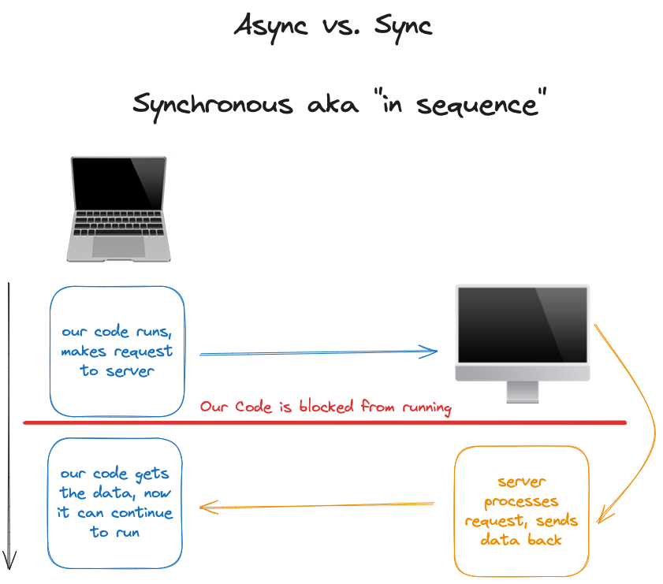
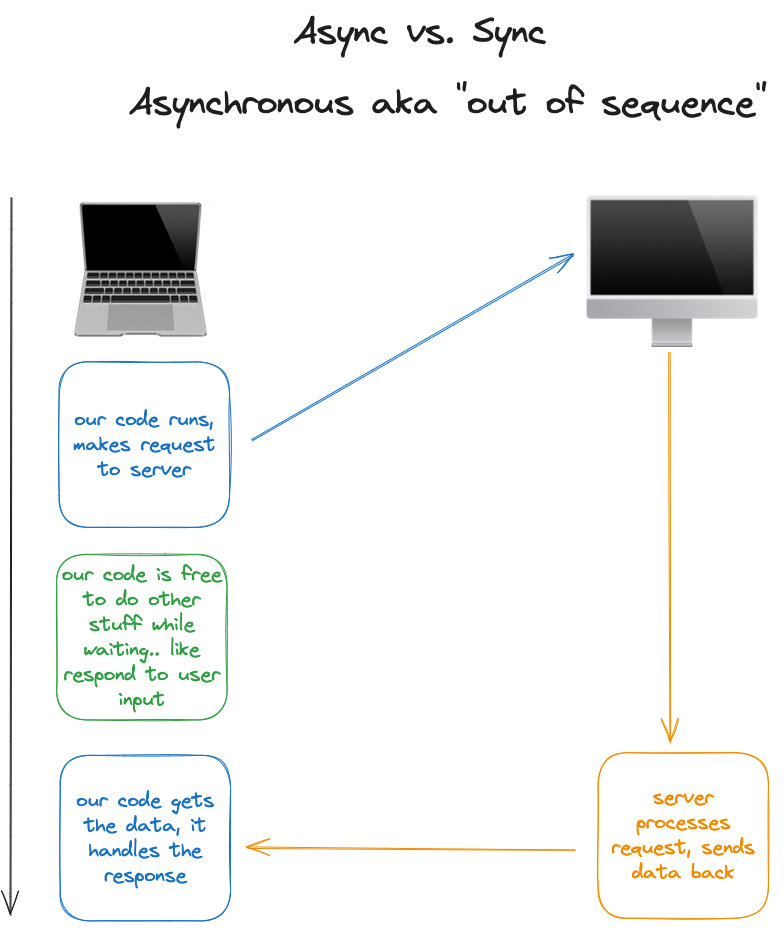
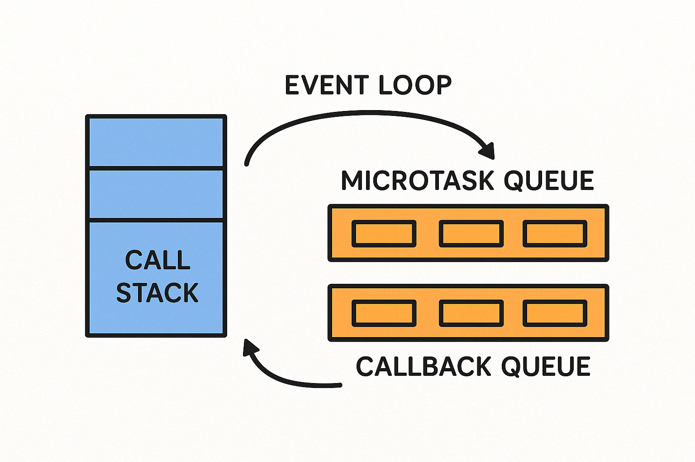
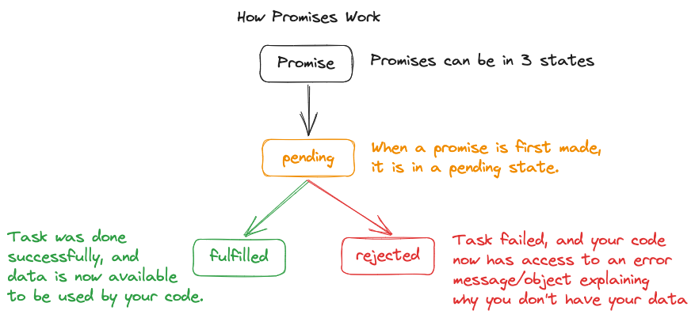

# Software Development Bootcamp

## Unit 2: JavaScript Foundations

### Lesson 6: Asynchronous JavaScript

### Gurneesh Singh

---

# Agenda

<div style="font-size: 20px;">

- Recap of Previous Lesson
- Section 1: Synchronous and Asynchronous Execution
- Section 2: Call Stack & Event Loop
- Section 3: Modern Async Patterns (Callbacks ➜ Promises ➜ Async/Await)
- Section 4: Error Handling in Async Code

</div>

---

# Learning Objectives

By the end of this class, you will be able to:

* Explain the difference between synchronous and asynchronous execution
* Describe how JavaScript's call stack and event loop work
* Transform callback‑based code into Promises and async/await
* Apply basic error‑handling patterns (try/catch, .catch(), throw)

---

# Recap 

## Functions Fundamentals

<div style="font-size: 20px;">

- **Function Basics**: Functions are reusable blocks of code that perform specific tasks
- **Inputs (Parameters)**: Data passed to functions for processing
  ```javascript
  function greet(name) { // name is a parameter
    return `Hello, ${name}!`;
  }
  greet("Sara"); // "Sara" is an argument
  ```
- **Outputs (Return Values)**: Data that functions produce after execution
  ```javascript
  function add(a, b) {
    return a + b; // Return value
  }
  ```
- **Execution Flow**: Functions execute in the order they're called
- **Function Composition**: Functions can call other functions

*Key takeaway: Understanding how functions receive inputs and produce outputs is crucial for asynchronous programming.*

</div>

---

# Section 1: Synchronous and Asynchronous Execution

## Two Ways Code Can Run

<div style="display: grid; grid-template-columns: 1fr 1fr; gap: 20px;">

<div style="font-size: 20px;">

**Synchronous Execution:** aka 'In Sequence'
- Code executes line by line, in order
- Each line must complete before the next line begins
- Blocks execution until a task is complete
- Simple to understand and debug

---

**Asynchronous Execution:** aka 'Out of Sequence'
- Code doesn't wait for tasks to complete
- Allows the program to continue while waiting
- Tasks complete in the background
- Results are handled when available

*JavaScript is single-threaded but can perform asynchronous operations*

</div>

<div>


</div>

</div>


---

<div style="display: flex; justify-content: center;">



</div>

---

<div style="display: flex; justify-content: center;">



</div>

---


## setTimeout and setInterval: JavaScript's Timing Functions

<div style="font-size: 18px; display: grid; grid-template-columns: 1fr 1fr; gap: 20px;">

<div>

**setTimeout**
- Executes a function once after a specified delay
- Syntax: `setTimeout(callback, delayInMs)`
- Returns a timer ID that can be used with `clearTimeout()`

---
```javascript
// Basic usage
setTimeout(() => {
  console.log("This runs after 2 seconds");
}, 2000);

// Store and clear a timeout
const timerId = setTimeout(() => {
  console.log("This will never run");
}, 1000);

// Cancel the timeout
clearTimeout(timerId);
```

</div>

<div>

---
**setInterval**
- Repeatedly executes a function at specified intervals
- Syntax: `setInterval(callback, intervalInMs)`
- Returns an interval ID that can be used with `clearInterval()`

---

```javascript
// Basic usage
const intervalId = setInterval(() => {
  console.log("This runs every 3 seconds");
}, 3000);

// Stop after 5 executions
let count = 0;
const counterId = setInterval(() => {
  count++;
  console.log(`Count: ${count}`);
  
  if (count >= 5) {
    clearInterval(counterId);
    console.log("Interval stopped");
  }
}, 1000);
```

</div>

</div>

*Both functions are asynchronous and don't block the main thread while waiting*

---

## Visualizing the Difference

<div style="font-size: 18px; display: flex; gap: 20px; justify-content: space-around">

<div>

**Synchronous**
```javascript
console.log("First");
console.log("Second");
console.log("Third");

// Output:
// First
// Second
// Third
```

</div>

<div>

---

**Asynchronous**
```javascript
console.log("First");
setTimeout(() => {
  console.log("Second - after delay");
}, 1000);
console.log("Third");

// Output:
// First
// Third
// Second - after delay (after 1 second)
```

</div>

</div>

---

## Real-World Use Cases for Asynchronous Code

<div style="font-size: 20px;">

1. **Network Requests**
   - Fetching data from a server (AJAX, API calls)
   - Uploading files to a server

2. **File Operations**
   - Reading or writing large files

3. **Timers and Intervals**
   - Scheduling code to run after a delay
   - Running code repeatedly at intervals

4. **User Experience**
   - Non-blocking UI while performing expensive operations
   - Loading animations while waiting for operations to complete

*Asynchronous code is crucial for creating responsive web applications*

</div>

---

# Section 2: The Call Stack and Event Loop

## How JavaScript Executes Code

<div style="font-size: 20px;">

JavaScript is **single-threaded** - it can only execute one piece of code at a time.

But how does it handle async operations with just one thread?

The answer lies in the:
- **Call Stack**
- **Web APIs** (provided by the browser)
- **Callback Queue**
- **Event Loop**

These mechanisms work together to make asynchronous JavaScript possible.

</div>

---

## The Call Stack

<div style="font-size: 20px;">

**Call Stack**: A data structure that records where in the program we are.

Think of it like a stack of plates:
- When a function is called, it's added to the stack (pushed)
- When a function completes, it's removed from the stack (popped)
- The function at the top of the stack is the one currently executing

```javascript
function first() {
  console.log("I'm first!");
  second();
}

function second() {
  console.log("I'm second!");
}

first();
```

Stack flow: `main` → `first` → `second` → (complete `second`) → (complete `first`) → (empty)

*JavaScript can only process one function at a time!*

</div>

---

## Web APIs and the Callback Queue

<div style="font-size: 18px;">

**Problem**: If JS can only run one thing at a time, how can it handle asynchronous operations?

**Solution**: It delegates long-running tasks to the browser!

1. **Web APIs**: Browser features that can handle tasks separately from JavaScript
   - `setTimeout`, `fetch`, DOM events, AJAX requests

2. **Callback Queue**: Where callbacks wait until the call stack is empty
   - Tasks get added here when their async operation completes

```javascript
console.log("Start");

setTimeout(function() {
  console.log("Timeout callback");
}, 1000);

console.log("End");
```

*The browser handles the timing while JavaScript continues executing other code*

</div>

---

## The Event Loop

<div style="font-size: 18px;">

**Event Loop**: Constantly checks if the call stack is empty and if there are tasks in the callback queue.

If the call stack is empty and there's a callback waiting, the event loop moves the callback to the stack.

---

```javascript
console.log("Hi!");                      // 1. This runs first

setTimeout(function timeout() {
  console.log("Click the button!");       // 3. This runs later (after 5 seconds)
}, 5000);

console.log("Welcome to event loop demo."); // 2. This runs second
```

<div style="text-align: center; margin-top: 20px;">
    
</div>

*The event loop is what enables JavaScript to perform non-blocking operations*

</div>

---

## Callbacks: The Foundation of Async JavaScript

<div style="font-size: 15px;">

**Callback**: A function passed as an argument to another function, which is invoked after some operation completes.

```javascript
// Event listener callback - something students are already familiar with!
buttonElem.addEventListener("click", function() {
  console.log("Button was clicked!");
  // This function is a callback - it runs later when the click happens
});

console.log("Event listener was set up"); // This runs first

// Another familiar example: setTimeout
setTimeout(function() {
  console.log("This message appears after 2 seconds");
  // This is also a callback function
}, 2000);

console.log("Timer was started"); // This runs before the timeout callback
```

*Callbacks let us specify what should happen when an asynchronous operation completes*

**Problem**: Complex async operations can lead to "callback hell" (deeply nested callbacks)

```javascript
// Example of callback hell
fetchUserData(userId, function(user) {
  fetchUserPosts(user.id, function(posts) {
    fetchPostComments(posts[0].id, function(comments) {
      // We're three levels deep now!
      console.log(comments);
      // And it gets worse if we need to do more operations
    });
  });
});
```

</div>

---

# 10-minute Break

---

# Section 3: Modern Async Patterns

## Callbacks – good start, bad finish

```javascript
// Three tasks that depend on each other 👇
first(() => {
  second(() => {
    third(() => {
      console.log("Done – but hard to read! ☹️");
    });
  });
});
```

*Nested callbacks quickly become hard to follow (a.k.a. "callback hell")*

---

## Promise fundamentals  🚦

<div style="display: grid; grid-template-columns: 1fr 1fr; gap: 20px;">


<div>

A Promise is **an IOU for a future value**.
It can be in one of three states:

1. 🟡 Pending
2. 🟢 Fulfilled (resolved)
3. 🔴 Rejected (error)

</div>

```javascript
const numberIsEven = (number) => new Promise((resolve, reject) => {
  // every promise has a resolve and reject function

  if (number % 2 === 0) {
    // resolve is called when the promise is fulfilled
    resolve("The number is even");
  } else {
    // reject is called when the promise is rejected
    reject("The number is odd");
  }

});
```

<div>

---

## How Promises Work

<div style="display: flex; justify-content: center;">



</div>

---

## Async / Await = syntactic sugar

```javascript
// BEFORE (promise chain)
wait(1000)
  .then(() => wait(500))
  .then(() => console.log("Done"));

// AFTER (async/await)
async function run() {
  await wait(1000);
  await wait(500);
  console.log("Done");
}
run();
```
---

# Section 4: Error Handling Basics

## The Error‑Handling Triangle

- So far, whenever we've had errors in our code, our code crashed.
- We want to write code that can anticipate failure, and handle them gracefully.


---

## try / catch (sync & async)

```javascript
try {
  riskyOperation();
} catch (e) {
  console.error(e.message);
}

// Async
async function go() {
  try {
    await wait(500);
    throw new Error("Kaboom");
  } catch (e) {
    console.error("Caught:", e.message);
  }
}
go();
```

---

## Promise .catch()

```javascript
wait(500)
  .then(() => JSON.parse("not‑json"))
  .catch(err => console.error("Handled:", err.message));
```

---

## Custom errors with throw

```javascript
function divide(a, b) {
  if (b === 0) {
    throw new Error("Cannot divide by 0");
  }
  return a / b;
}
```
---
# Next Lesson Preview

•  Introduction to HTTP, JSON, and REST APIs  

