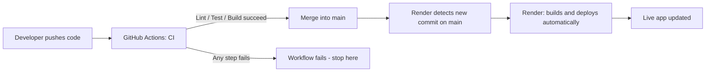

# CI/CD with GitHub Actions for a React + Vite Project

## What is CI/CD? [Blog](https://www.redhat.com/en/topics/devops/what-is-ci-cd#:~:text=Continuous%20integration%20%28CI%29%20refers%20to,and%20delivery%20of%20code%20changes)

**CI/CD** stands for **Continuous Integration** and **Continuous Deployment/Delivery**. It's a modern software development practice that automates and streamlines integrating code, running tests, and deploying applications.

### Continuous Integration (CI)

CI is the practice of regularly merging all developers' working copies into a shared mainline, often multiple times a day. It involves:

* Automatically building code
* Running tests
* Identifying bugs early, before they reach production

### Continuous Delivery (CD)

Continuous Delivery means every code change that passes CI is automatically **prepared and packaged for release**, but a human still clicks a button to actually push it to production. It involves:

* Automated deployment to a staging environment
* A **manual approval step** before deploying to production

### Continuous Deployment (CD)

Continuous Deployment goes one step further: every change that passes CI is deployed to production **automatically, with no manual approval step at all**.

### Continuous Delivery vs. Continuous Deployment — the actual difference

Both practices are called "CD," which is where the confusion usually starts. The entire difference comes down to **one thing: is there a manual approval step before production, or not?**

| | Continuous Delivery | Continuous Deployment |
|---|---|---|
| Code passes CI (tests/build) | ✅ Automatic | ✅ Automatic |
| Deployed to staging | ✅ Automatic | ✅ Automatic |
| Deployed to production | ❌ Requires a human to approve/click "deploy" | ✅ Automatic, no human involved |

**Where does our Render setup fit?** Render redeploys the app automatically every time new code lands on the `main` branch — nobody has to click anything. That means what we're using is **Continuous Deployment**, not just Continuous Delivery.

---

## The Full Picture: Where GitHub Actions and Render Fit

The pipeline is really two separate, connected systems:



GitHub Actions and Render are doing *different jobs*:

* **GitHub Actions (CI)** — verifies the code is good: does it install, lint, test, and build cleanly?
* **Render (CD)** — takes the code that made it to `main` and actually deploys it.


---

## Why CI/CD Is Important

* **Faster release cycles** — automates testing and deployment.
* **Improved code quality** — bugs are caught early through automated testing.
* **Better collaboration** — developers work independently and merge frequently.
* **Quick feedback** — integration issues surface immediately, not weeks later.
* **Reduced manual errors** — automation removes repetitive human steps.

---

## Major Cloud/Platform Providers for CI/CD

| Provider               | Features                                                                            |
| ----------------------- | ------------------------------------------------------------------------------------ |
| **GitHub Actions**      | Native CI/CD for GitHub. YAML-based workflows, reusable actions, easy to use.        |
| **GitLab CI/CD**        | Fully integrated with GitLab. Supports pipelines, environments, Docker, Kubernetes.  |
| **AWS CodePipeline**    | Fully managed CI/CD service integrated with the AWS ecosystem.                       |
| **Azure DevOps**        | CI/CD pipelines with deep integration into Azure services.                           |
| **Google Cloud Build**  | Serverless CI/CD solution for GCP services.                                          |
| **Render**              | Not a CI tool itself, but supports **auto-deploy on push** — the "CD" half of this pipeline. |

---

## Introduction to GitHub Actions

**GitHub Actions** is a CI/CD tool built directly into GitHub. It automates workflows for building, testing, and deploying code.

### Key Concepts (vocabulary you'll see in the YAML)

| Term | Meaning |
|---|---|
| **Workflow** | The whole automated process, defined in one YAML file. |
| **Trigger (`on`)** | The GitHub event that starts the workflow (push, pull request, etc). |
| **Job** | A group of steps that run on the same runner (virtual machine). |
| **Runner** | The virtual machine that executes the job (e.g. `ubuntu-latest`). |
| **Step** | A single task inside a job — either a shell command or a reusable **Action**. |
| **Action** | A reusable, pre-built step (e.g. `actions/checkout`), shared via the GitHub Marketplace. |

---

## YAML Basics (Before You Touch the Workflow File)

GitHub Actions workflows are written in **YAML** (`.yml` or `.yaml`), a plain-text format for structuring data. If this is your first time seeing it, here are the rules that matter:

* **Indentation defines structure.** YAML uses spaces (not tabs) to show what belongs inside what. Two spaces per level is the common convention.
* **`key: value` pairs.** Most lines look like `name: CI` — a key, a colon, then a value.
* **Lists use a dash (`-`).** A `-` at the start of a line means "this is one item in a list." Several steps in a row, each starting with `- name:`, means a list of steps.
* **Nesting = relationship.** If `value` is indented under `key`, it means `value` belongs to `key`. Get the indentation wrong and the file either errors out or means something different than you intended.
* **`#` starts a comment.** Anything after `#` on a line is ignored by GitHub Actions — it's there for humans reading the file.
* **`${{ }}` is a GitHub Actions expression.** It's how you reference dynamic values, like `${{ secrets.MY_SECRET }}` to pull in a stored secret, or `${{ github.ref }}` to reference the current branch.

A minimal example, so you can see the shape before looking at the real file:

```yaml
name: Example              # a top-level key
on: push                   # a top-level key
jobs:                      # a top-level key, with nested content below it
  say-hello:                # this is the job's name (you choose it)
    runs-on: ubuntu-latest   # nested under say-hello
    steps:                   # a list starts here
      - name: Print message  # first item in the list (note the "-")
        run: echo "Hello!"
      - name: Print again     # second item in the list
        run: echo "Hello again!"
```

Keep this shape in mind as you read the real workflow below — it's the same pattern, just with more steps.

---

## Setting Up CI for a React + Vite Project Using GitHub Actions

### Step 1: Project Setup

Make sure you have a working **React + Vite** project with this general structure:

```
my-react-app/
├── public/
├── src/
├── .gitignore
├── index.html
├── package.json
├── package-lock.json
├── vite.config.js
```


### Step 2: Add a GitHub Actions Workflow

Create a folder called `.github/workflows/` in your project root, and inside it a file named `ci.yml`:

```yaml
name: CI

# Run this workflow when code is pushed to main, or when a PR targets main
on:
  push:
    branches: [ main ]
  pull_request:
    branches: [ main ]

jobs:
  build:
    runs-on: ubuntu-latest      # Fresh Ubuntu VM for this job

    steps:
      - name: Checkout code
        uses: actions/checkout@v4     # Clones your repo into the runner

      - name: Setup Node.js
        uses: actions/setup-node@v4
        with:
          node-version: '20'          # Match the Node version you develop with
          cache: 'npm'                # Speeds up repeat runs by caching node_modules

      - name: Install dependencies
        run: npm ci                   # Clean, reproducible install from package-lock.json

      - name: Lint
        run: npm run lint --if-present   # Skips gracefully if no "lint" script exists

      - name: Run tests
        run: npm test --if-present       # Skips gracefully if no "test" script exists

      - name: Build project
        run: npm run build            # Production build via Vite (outputs to /dist)
```

### Explanation of Each Step

* **`on`** — defines what events trigger the workflow. Running on `pull_request` as well as `push` means broken code is flagged *before* it's merged into `main`, not after.
* **`jobs` / `runs-on`** — each job runs on its own clean virtual machine.
* **`steps`**:
  * `actions/checkout` — pulls your repository code onto the runner.
  * `actions/setup-node` — installs Node.js; the `cache: 'npm'` option caches dependencies between runs so installs are faster.
  * `npm ci` — installs the *exact* versions from `package-lock.json` (faster and more reliable than `npm install` for CI).
  * `npm run lint --if-present` / `npm test --if-present` — `--if-present` prevents the workflow from failing just because a script isn't defined yet in `package.json`. Remove this once your project has real lint/test scripts, so their *absence* isn't silently ignored.
  * `npm run build` — the actual Vite production build. This is the step that proves the app is deployable.

### Step 3: Push to GitHub

1. Commit and push your code, including the `.github/workflows/ci.yml` file.
2. Open the **Actions** tab in your GitHub repository.
3. You should see the workflow run automatically on the push, and on any future pull request into `main`.
4. Click into a run to see logs for each step — this is how you debug a failing build.

---

## Deployment to Render

Render automatically deploys the app whenever it detects a new commit on the connected branch (typically `main`) — this is Render's own auto-deploy feature, separate from GitHub Actions.

How the two pieces fit together in practice:

* GitHub Actions' job is to **verify** the code (install, lint, test, build) — it does **not** deploy anything itself in this setup.
* Render's job is to **deploy** whatever lands on `main`.
* We don't need a "deploy" step in the GitHub Actions workflow, since Render is already watching the repo.

### Environment Variables — an important distinction

There are two separate places variables can live, and they serve different purposes:

* **Backend / runtime secrets** (API keys, database URLs, etc.) → these belong in the **Render dashboard**, not in your codebase and not in GitHub Actions. They're injected when Render builds and runs the app.
* **Frontend / build-time variables** — for a Vite app, any variable your browser code reads must be prefixed `VITE_` (e.g. `VITE_API_URL`), and it gets **baked into the JavaScript bundle at build time**. Since Render performs the actual build that gets deployed, these also belong in Render's environment settings.
* Never commit a `.env` file with real values to the repository, and never print secret values in workflow logs.

#### If you ever need a variable inside GitHub Actions itself

This is different from the Render variables above — it's only needed if a CI step itself requires a value (for example, running tests against a mock API key).

* A real secret, stored securely: go to your GitHub repository → **Settings → Secrets and variables → Actions → New repository secret**, give it a name and value, then reference it in the workflow as `${{ secrets.MY_SECRET }}`. GitHub hides secret values in the workflow logs automatically.

---

## Troubleshooting Checklist

| Symptom | Likely cause |
|---|---|
| `npm ci` fails immediately | `package-lock.json` wasn't committed, or is out of sync with `package.json`. |
| Workflow doesn't appear under the **Actions** tab | File isn't at exactly `.github/workflows/ci.yml`, or has invalid YAML indentation. |
| Build passes in CI but the Render deploy fails | Missing environment variable in the Render dashboard (see above) — CI doesn't test against Render's env vars. |

---

## Best Practices

* Run CI on both `push` and `pull_request` so problems are caught *before* merge, not after.
* Keep workflows simple — one clear job (install → lint → test → build) is easier to teach and debug than a sprawling pipeline.
* Never expose secret `.env` values in workflow files or logs.
* Use `npm ci`, not `npm install`, in CI — it's faster and reproducible.
* Cache dependencies (`cache: 'npm'`) to keep workflow runs fast.

---

**References**:

* [GitHub Actions Documentation](https://docs.github.com/en/actions)
* [Render Deployment Docs](https://render.com/docs/deploy-a-react-app)
* [Vite: Env Variables and Modes](https://vitejs.dev/guide/env-and-mode.html)